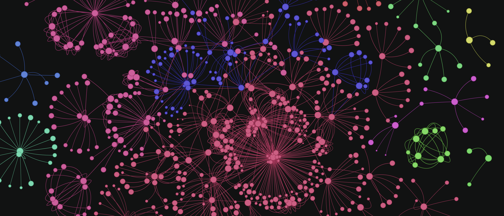

# Convert any Corpus of Text into a *Graph of Knowledge*

*A knowledge graph generated using this code*

## What is a knowledge graph?
A knowledge graph, also known as a semantic network, represents a network of real-world entities—i.e. objects, events, situations, or concepts—and illustrates the relationship between them. This information is usually stored in a graph database and visualized as a graph structure, prompting the term knowledge “graph.”

Source: https://www.ibm.com/topics/knowledge-graph

## How to create a simple knowledge graph from a body of work?
1. Clean the text corpus (The body of work).
2. Extract concepts and entities from the body of work.
3. Extract relations between the entities. 
4. Convert a graph schema. 
5. Populate nodes (concepts) and edges (relations).
6. Visualise and Query. 

Step 6 is purely optional, but it has certain artistic gratification associated with it. Network graphs are beautiful objects (just look at the banner image above, isnt it beautiful?). Fortunately there are good number of python libraries available for generating graph visualisations. 

## Why Graph?
Once the Knowledge Graph (KG) is build, we can use it for many purposes. We can run graph algorithms and calculate centralities of any node, to understand how important a concept (node) is to this body of work. We can calculate communities to bunch the concepts together to better analyse the text. We can understand the connectedness between seemingly disconnected concepts. 

The best of all, we can achieve **Graph Retrieval Augmented Generation (GRAG)** and chat with our text in a much more profound way using Graph as a retriever. This is a new and improved version of **Retrieval Augmented Generation (RAG)** where we use a vectory db as a retriever to chat with our documents. 

---

## This project
Here I have created a simple knowledge graph from a pdf document. All the components I used here are set up locally, so this project can be run very easily on a personal machine. 
I have adopted a no-GPT approach here to keep things economical. I am using the fantastic *Mistral 7B openorca instruct* as LLM which crushes this use cases wonderfully. The model can be set up locally using Ollama so generating the KG is basically free (No calls to GPT).

Here is a list of libraries I am using in this project

### Mistral 7B with Ollama.
The Amazing Mistral 7b model for extracting concepts out of text chunks. 

### Python Pandas 
dataframes for graph schema (can use a graphdb at a later stage).

### NetworkX 
This is a python library that makes dealing with graphs super easy

### Pyvis
Pyvis python library for visualisation. It generates amazing web visualisatins using VueJS, so the final graphs can be hosted on the web like github pages. 

// Still to complete this README //